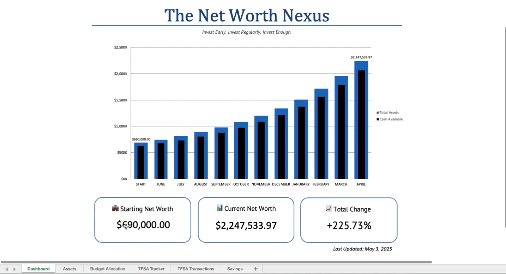

# 💼 The Net Worth Nexus 🚀

A beautifully crafted Excel dashboard for tracking **NET WORTH, SAVINGS, INVESTMENTS, and INCOME ALLOCATION.** -Julian Griffin

  
> _"Invest Early. Invest Regularly. Invest Enough."_

---

## 📊 What’s Inside?

This Excel dashboard is a **one-stop command centre** for managing personal finances with elegance and clarity:

1. **Net Worth Tracker**  
  Visualizes your total assets over time with sleek monthly bar charts and summary stat boxes.

2. **Budget Allocation Tool**  
  Enter your income, and see how much to allocate to cash, savings, and investments (with a clean donut chart 🍩).

3. **TFSA Investment Portfolio**  
  Log trades, track performance, and compare your stocks vs the S&P 500.

4. **Savings Tracker**  
  Set short and long-term savings goals, track deposits/withdrawals, and see real-time % progress bars.

---

## 🧾 Features

✨ **Automated Growth Calculations**  
📅 Dynamic month-over-month updates  
📉 Clean separation of asset classes (cash vs investments)  
🔄 Lookup formulas to always show the *most recent* data  
🎯 Smart visual callouts for goals and milestones  
📁 Easy to expand and adapt as your wealth grows  

---

## 🧠 Built With

- **Microsoft Excel for Mac**
- Formulas: `LOOKUP`, `IF`, `INDEX`, `MATCH`, `SUMIFS`, conditional formatting
- Explore the various charts: Bar, Pie, Donut, Line

---

## 🚀 How to Use

1. **Enter income** in the Budget sheet.
2. **Log savings deposits or withdrawals** on the Savings sheet.
3. **Track your investments** by logging TFSA trades.
4. Watch your **Net Worth Dashboard** come to life in real time.

---

## 📌 Future Enhancements

- 📊 Add a top down budjeting worksheet  
- 🧠 Add a liability section to the dashboard
- 📈 Project future growth from past rates

---

> _“Pay Yourself First.” – Robert Kiyosaki_
